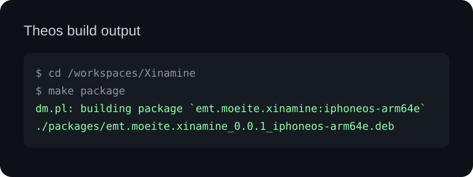
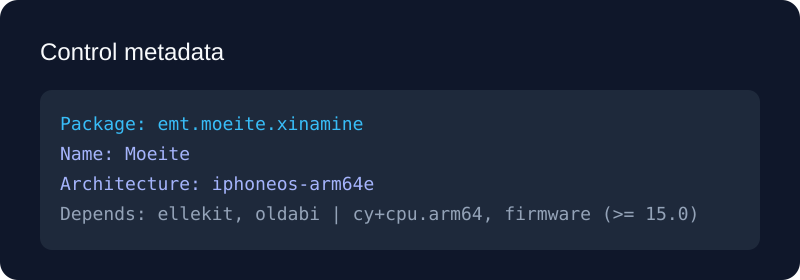
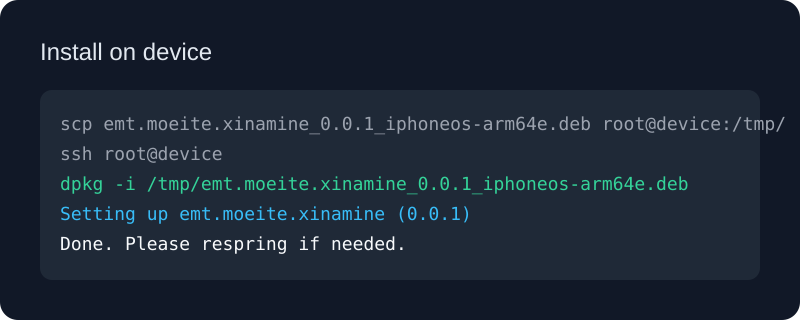
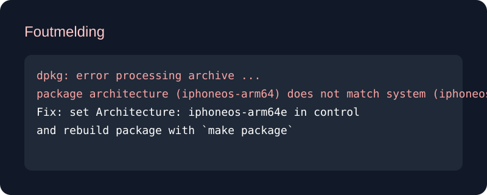
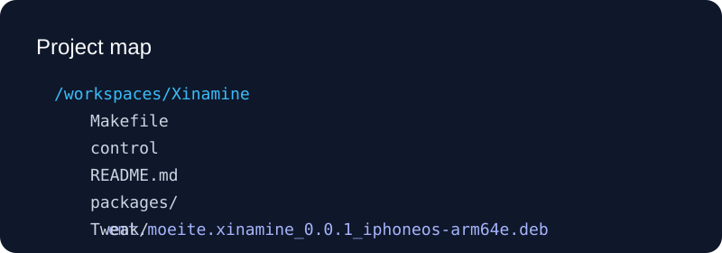

# Moeite

`Moeite` is een Theos-tweak die compatibiliteit toevoegt voor Xina-gepatchte tweaks in Dopamine.

## Wat doet dit project?

- Bouwt een rootless Debian-package voor iOS
- Ondersteunt `iphoneos-arm64e` apparaten zoals iPhone 12 Pro Max op iOS 16.x
- Verwijdert oude package-architectuurproblemen en past metadata aan voor correcte installatie

## Projectstructuur

- `Makefile` - hoofd Makefile voor het bouwen van de Theos-package
- `control` - Debian metadata voor de package
- `Tweak/Makefile` - Theos-tweak buildconfiguratie
- `Tweak/Sources/` - broncode van de tweak
- `packages/` - output .deb package na een succesvolle build

## Vereisten

- Theos geïnstalleerd en bereikbaar via `$(HOME)/theos` of `THEOS` environment variable
- iPhoneOS SDK beschikbaar in `$(THEOS)/sdks/iPhoneOS16.5.sdk`
- `dpkg` / `apt` op het jailbreak-apparaat voor installatie
- iOS-apparaat met `arm64e` (bijv. iPhone 12 Pro Max) en een compatibele jailbreak

## Belangrijke metadata

- Package ID: `emt.moeite.xinamine`
- Naam: `Moeite`
- Versie: `0.0.1`
- Architectuur: `iphoneos-arm64e`
- Afhankelijkheden: `ellekit`, `oldabi | cy+cpu.arm64`, `firmware (>= 15.0)`

## Bouwen en installeren

1. Open een terminal in de projectroot:

```bash
cd /workspaces/Xinamine
```

2. Controleer of Theos en de SDK beschikbaar zijn:

```bash
echo $THEOS
ls "$THEOS/sdks/iPhoneOS16.5.sdk"
```

3. Bouw de package:

```bash
make package
```

4. Na een geslaagde build vind je de `.deb` in:

```bash
packages/emt.moeite.xinamine_0.0.1_iphoneos-arm64e.deb
```

5. Kopieer de `.deb` naar je toestel en installeer met `dpkg -i`:

```bash
dpkg -i /path/to/emt.moeite.xinamine_0.0.1_iphoneos-arm64e.deb
```

6. Herstart het apparaat of refresh de tweak-omgeving als dat nodig is.

## Problemen oplossen

- `package name has characters that aren't lowercase alphanums or '-+.'`:
  - Gebruik alleen lowercase letters, cijfers, `.` `-` of `+` in `control`
- `package architecture does not match system`:
  - Controleer dat `Architecture` in `control` op `iphoneos-arm64e` staat
- Indien `Theos` ontbreekt:
  - Stel `THEOS` in op je Theos-installatiemap of installeer Theos eerst

## Aanpassen van naam en package-id

- Als je de zichtbare appnaam wilt wijzigen, pas dan `Name:` in `control` aan
- Voor de interne package-ID wijzig je `Package:` in `control`

## Aanbevolen workflow

1. Pas bestandsnamen en metadata aan in `control`
2. Bouw met `make package`
3. Test op je iPhone met `dpkg -i`
4. Herhaal voor fixes

## Uitlegplaatjes (visuele ondersteuning)

Hieronder staan voorbeeldillustraties die je kunt gebruiken in de README of documentatie.

### Theos build output



### Control metadata



### Installatie op apparaat



### Foutmelding architectuur mismatch



### Projectstructuur



---

*Opmerking:* de package-bestandsnaam wordt afgeleid van `Package`, `Version` en `Architecture`, dus een goede `Package:` waarde voorkomt installatieproblemen.
